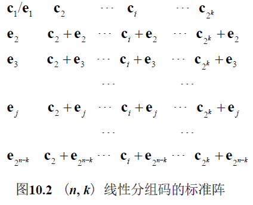

<!-- ---
title: 第十章 - 线性分组码
date: 2022-06-13T11:00:00+08:00
categories: ["信息论"]
layout: note
article: false
--- -->

# 第十章 线性分组码

## 10-1 近世代数的基础知识

### 10-1-1 整数的有关概念

- 最大公约数（a, b）的性质：任意正整数a, b，必存在整数A, B，使$(a, b)= Aa + Bb$
- 同余：$a \equiv b(\bmod m)$
- 剩余类：余数相同的数

### 10-1-2 群的基本概念

**定义 10.4** 设G是非空集合，并在G内定义了一种代数运算，
若满足如下四个条件，则称G为一个群：
1. 封闭性。 对任意$a\in G$，$b\in G$，恒有$a \operatorname{O} b\in G$。
2. 结合率成立。对任意$a\in G$，$b\in G$，$c\in G$，恒有 $(a \operatorname{O} b)\operatorname{O} c = a \operatorname{O} (b \operatorname{O} c)$。
3. 若 G 中有一元素e，对任意的 $a\in G$，满足 $a\operatorname{O}e = e\operatorname{O}a = a$，则 e 称为单位元或恒元。
4. 若对于任意 $a\in G$，G 中存在有另一元素 $a^{–1}$，使 $a \operatorname{O} a^{–1} = a^{–1}\operatorname{O} a = e$，则 $a^{–1}$称为 a 的逆元。

- 若群G的二元运算满足交换率，即若 $a\in G$，$b\in G$，有 $a \operatorname{O} b = b \operatorname{O} a$，则称群 G 为交换群，亦称为 Abel 群
- 群中元素的个数，称为群的阶。根据元素个数是否有限，可以分为有限阶群和无限阶群

**定理 10.1** 群具有如下性质：
1. 群 G 中恒元是唯一的；
2. 任一个群元素的逆元是唯一的。

**定义 10.5** 若群G的非空子集H对于G中定义的代数运算也构成群, 则称H是G的**子群**

**定义 10.6** 设G的子群 $\mathrm{H}=\left\{h_{1}=e, h_{2}, \ldots, h_{r}\right\}, a \in \mathrm{G}$, 但 $a \notin \mathrm{H}$, 将它与 $\mathrm{H}$ 中的元依次相加, 得 $a+\mathrm{H}=\left\{a+h_{i}, i\right.$ $=1,2, \ldots, r\}$, 称 $a+\mathrm{H}$ 为 $\mathrm{H}$ 的一个陪集 (Coset), $a$ 称为该陪集的陪集首。

- H的陪集可能有许多个，因此可以将H进行陪集展开。G的每一元仅在子群H的一个陪集中

### 10-1-3 环的基本概念

**定义 10.7** 非空集合 R 中, 若定义了两种代数运算加和乘, 且满足
1. 集合R在加法运算下构成 Abel 群;
2. 乘法有封闭性, 即对任何 $a \in \mathrm{R}, b \in \mathrm{R}$, 有 $a b \in \mathrm{R}$;
3. 乘法分配率及结合率成立, 即对任何 $a \in \mathrm{R}, b \in \mathrm{R}$ 和 $c \in \mathrm{R}$ 有
$$a(b+c)=a b+a c$$
$$(b+c) a=b a+c a$$
$$(a b) c=a(b c)$$
则称 $\mathrm{R}$ 是一个环。若环 $R$ 对乘法满足交换率, 即对任何 元素 $a \in \mathrm{R}$ 和 $b \in \mathrm{R}$, 恒有 $a b=b a$, 则称此环为交换环或 $A b e l$ 环。

**性质**：对于任何 $a\in R, b\in R$，
1. $a\cdot0=0\cdot a=0$
2. $a(-b)=(-a)b=-ab$
3. 环中可以有零因子：即两个非零元素相乘得到0
   - 有零因子环中乘法消去律不成立
   - 无零因子环中乘法消去律成立
4. 有单位元且每个非零元素有逆元、非可换的环，称为除环

### 10-1-4 域的基本概念

**定义 10.8** 非空元素集合F, 若在F中定义了加和乘两种运算, 且满足
1. F关于加法构成Abel 群, 其加法恒元记为 0 ;
2. F中非零元素全体对乘法构成Abel 群, 乘法恒元记为 1 ;
3. 加法和乘法间有如下分配律：$a(b+c)=a b+a c,\quad(b+c) a=b a+c a$，则称 $\mathrm{F}$ 是一个域

域是一个可换的、有单位元的、非零元素有逆元的环。

**定理 10.2** 域具有如下的基本性质:
1. 域中一定无零因子, 即:
若 $a, b \in \mathrm{F}, a \neq 0, b \neq 0$, 则 $a b \neq 0$
2. 任何 $a, b, c \in \mathrm{F}$, 有
- $a \cdot 0=0 \cdot a=0$
- $-(a \cdot b)=(-a) \cdot b=a \cdot(-b)$
- 若 $a \cdot b=0$ 且 $a \neq 0$, 则 $b=0$;
- 若 $a \cdot b=a \cdot c$ 且 $a \neq 0$, 则 $b=c$ 。

3种典型的有限域：
- 二元域 $\mathrm{GF}(2)$ ： 集合 $\{0,1\}$ 在模2加法和模2乘法下, 是 两个元素的域 $\mathbf{G F}(2)$
- $p$ 元域 $\mathrm{GF}(p)$ ：令 $p$ 为素数，集合 $\{0,1, \cdots, p-1\}$ 在模 $p$ 加法和模 $p$ 乘法下是阶为 $p$ 的域, 称为素域GF $(p)$
- 扩域GF $\left(p^{m}\right)$ ： 将素域 $\mathrm{GF}(p)$ 扩展成有 $p^{m}$ 个元素的域, 即得 $\mathrm{GF}(p)$ 的 $m$ 次扩域 $\mathrm{GF}(q)$ 。扩域GF $\left(p^{m}\right)$ 可用一个多 项式 $p(x)$ 来描述

**特征**：最小的正整数 $\lambda$ 使得 $\sum_{i=1}^\lambda 1=0$ 即 $\lambda\cdot1=0$
1. 素数域 $\mathrm{GF}(p)$ 的特征是 $p$
2. 有限域的特征是素数
3. $\mathrm{GF}(\lambda)$ 是 $\mathrm{GF}(q)$ 的子域，有 $q$ 是$\lambda$ 的幂

**定理 10.13** 有限域的阶必为其特征之幂

**域元素 a 的阶**:最小的正整数 $n$ 使得 $a^n=1$
1. $a^i\cdot a^j=a^{(i+j)\bmod n}$
   - 元素 $a^{n}=1$ 和 $a^{1}, a^{2}, \cdots, a^{n-1}$ 在GF $(q)$ 乘法下形成群, 称为循环群
2. 若 $a \in \mathrm{GF}(q), a \neq 0$, 则 $a^{q-1}=1$
3. 若 $a \in \operatorname{GF}(q), a \neq 0$, 令 $n$ 是 $a$ 的阶, 则 $q-1$ 能被 $n$ 除 尽。如果 $a$ 的阶是 $q-1$, 则称 $a$ 是本原的, $a$ 为本原元素，简称本原元。本原元素的各次幂生成GF $(q)$ 的所有非零元素
4. 若 $\mathrm{GF}\left(p^{m}\right)$ 的特征为 $p$, 且 $a 、 b \in \mathrm{GF}\left(p^{m}\right)$, 则 $(a+b)^{p}=a^{p}+b^{p}$

### 10-1-5 二元域的运算

系数取自 GF(2) 的 n 次多项式：例如序列 10011:$f(x)=x^4+x+1$
1. 可以按普通方法加减乘除
2. 满足交换律、结合律、分配律
3. 可做长除法

#### 既约多项式

**定义 10.9** 若GF(2)上的m次多项式不能被GF(2)上的任何次数小于 m 但大于零的多项式除尽，
就称它是GF(2)上的**既约多项式**（约到头的多项式）

例如 $f(x)=x^4+x+1$ 是4次既约多项式

- 对任意m≥1，存在有m次既约多项式
- 能被分解因式的，都不是既约多项式
- GF(2)上的任意m次既约多项式，除尽 $x^n +1$

#### 本原多项式

**定义 10.10** 若 m 次既约多项式 p(x) 除尽的 $x^n+1$ 的最小正整数 n满足 $n=2^m–1$，
称p(x)为本原多项式

1. 本原多项式一定是既约的，因为它是用既约多项式来定义的，但既约多项式不一定是本原的
2. 对于给定的m，可能有不止一个m次本原多项式。

## 10-2 线性分组码的编码

### 10-2-1 有关概念

**定义 10.12** 码长为n，有 $2^k$ 个码字的分组码，当且仅当其 $2^k$ 个码字构成域 GF(2)
上所有n重矢量空间的一个k维子空间时，称该分组码为(n, k)线性分组码
- n重二进制码元组成的集合 $V_n$ 称为二进制的矢量空间
- 矢量空间 $V_n$ 的一个子集 S 如果满足以下两个条件，则称其为 $V_n$ 的一个子空间
  1. 全0矢量在S中
  2. S中任意两个矢量的和也在S中（即满足封闭性）

* 假设 $\mathrm{c}_{i}$ 和 $\mathrm{c}_{j}$ 是 $(n, k)$ 二进制分组码中的两个码字（或码矢量）, 当且仅当 $c_{i}+c_{j}$ 也是一个码矢量时, 这个码才是线性的; 特别地，当 $\mathbf{c}_{i}=\mathbf{c}_{j}$ 时，$\mathbf{c}_{i}+\mathbf{c}_{j}=\mathbf{0}$
* 二元分组码是**线性**的充要条件是**两个码字的模2和也是码字**；或者说线性分组码的子集以外的矢量不能由该子集内的码字相加产生

分组码的线性只与选用的码字有关，而与消息序列怎样映射到码字无关

称满足 $x_1+x_2$映射为码字 $c_1+c_2$ 的关系为线性分组码的特殊关系
- 只要全0的消息序列映射为全0的码字，都能满足特殊关系

**定理 10.5** 线性分组码的最小距离等于非零码字的最小重量

### 10-3-1 伴随式译码

令 $A_{i}$ 是线性码 $C(n, k)$ 中重量为 $i$ 的码矢数目, $p$ 是二 进制对称信道 (BSC) 的转移概率, 若在 $\mathbf{B S C}$ 上 $\mathbf{C}$ 只用 来检错, 用 $\boldsymbol{P}_{\mathrm{u}}(\boldsymbol{E})$ 表示末检出错误的概率, 即错误图样恰 好为码字的概率。对于任意重量 $\mathbf{i}$, 这种情况的概率 为 $p^{i}(1-p)^{n-i}$ 而重量为 $\mathbf{i}$ 的码矢数目为 $\mathbf{A}_{\mathbf{i}}$, 考虑到全部 的 $\mathbf{i}$, 故有
$$P_{\mathrm{u}}(E)=\sum_{i=1}^{n} A_{i} p^{i}(1-p)^{n-i}$$

### 10-3-2 标准阵

**定义 10.14** 把 $2^n$ 个可能的接收矢量划分成 $2^k$ 个不相交的子集，使每个子集只含有一个码矢，这个阵列称为标准阵

落在一个子集里的接收矢量就判给同一个码字

一行是一个陪集

- 应该要把重量较小的码字作为陪集首（第一列），这样能译为离接收码字最接近的码字
- 令 $\alpha_{i}$ 表示重量为 $i$ 的陪集首的数目, $\alpha_{1}, \alpha_{2}, \ldots, \alpha_{n}$ 称 为陪集首的重量分布, 当且仅当错误图样不是陪集首时才出现译码错误, 故对于转移概率为 $p$ 的二进制对称信道 而言, 采用标准阵译码方法所产生的译码错误概率为
$$P(E)=1-\sum_{i=1}^{n} \alpha_{i} p^{i}(1-p)^{n-i}$$
- 一个陪集的所有 $2^k$ 个码字有同样的伴随式，不同陪集的伴随式互不相同
  - $\mathbf{s} =\left(\mathbf{e}_{l}+\mathbf{v}_{i}\right) \mathbf{H}^{\mathrm{T}}=\mathbf{e}_{l} \mathbf{H}^{\mathrm{T}}+\mathbf{v}_{i} \mathbf{H}^{\mathrm{T}}=\mathbf{e}_{l} \mathbf{H}^{\mathrm{T}}$

### 10-3-3 伴随式译码的一般步骤及性能

**定理 10.7** 按照标准阵将接收码字译为它与它所在陪集的陪集首的模2和的译码算法是最小距离译码算法

## 10-4 线性分组码举例

**定义 10.15** 距离为 3 的线性分组码 $\left(2^{m}-1,2^{m}-1-m\right)$ 为汉明码, 其中 $\boldsymbol{m}$ 为任何不小于 2 的整数。
汉明码能够纠正 1 个错误, 它的码长 $n=\mathbf{2}^{m}-\mathbf{1}$, 消息序 列的长度 $k=2^{m}-1 \mid-m$, 一致校验部分的位数 $n-k=m$, 故其编码效率为
$$R=\left(2^{m}-1-m\right) /\left(2^{m}-1\right)$$

**定义 10.16** 设C是 $(n, k)$线性分组码，其纠错能力为t。如果用且只用不大于t个错误的全部错误图样作陪集首就能构成标准阵，那么就称这个码为**完备码**。
