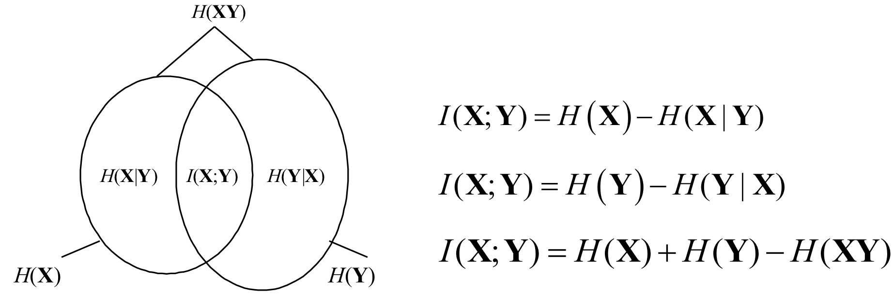

<!-- ---
title: 第二章 - 信息的度量
date: 2022-02-28T15:00:00+08:00
categories: ["信息论"]
layout: note
article: false
--- -->

# 第二章 信息的度量

## 2-1 度量信息的基本思路

**定义 2.1**：若信源发出的消息是离散的、有限或无限可数的符号或数字，且一个符号代表一条完整的消息，则为**单符号离散信源**

**定义 2.2**： 若信源的输出是随机事件 X，其出现概率为 $P(X)$，则它们所构成的集合称为 **信源的概率空间** 或 **信源空间**

信源空间的描述：
$$[\mathbf{X} \cdot P]:\left\{\begin{array}{ccccc}\mathbf{X}: & x_{1}, & x_{2}, & \ldots, & x_{N} \\ P(\mathbf{X}): & P\left(x_{1}\right), & P\left(x_{2}\right), & \ldots, & P\left(x_{N}\right)\end{array}\right.$$

有 $\sum_{i=1}^N P(x_i)=1$

信源输出的事件的概率越小，信息量越大，即信息量是概率的减函数

自信息量 $I(x_i)$ 表示 $x_i$ 发生所带来的信息量

**定义 2.3** ==自信息量== $I(x_i)=\log\frac{1}{P(x_i)}=-\log P(x_i)$

信息量的单位：
- 以 2 为底：比特 bit
- 以 e 为底；奈特 nat
- 以 10 为底：哈特 Hart
- $1 nat \approx 1.44 bit, 1 Hart \approx 3.32 bit$

### 自信息量和不确定度的关系

- 联系：
  - 两者都是事件概率的函数，数值和量纲一致
- 区别：
  - 不确定度是一个统计量，静态状态下也存在；
  - 自信息量只有该随机事件发生时才给出，是动态的概念

## 2-2 信源熵和条件熵

**定义 2.4** ==信源熵== ：$H(X)=\sum_{x\in X} P(x)I(x)=\sum^N_{i=1}P(x_i)I(x_i)=-\sum_{i=1}^N P(x_i)\operatorname{lb} P(x_i)=H(p_1,\dots,p_N)$，其中定义 $0\operatorname{lb}0=0$

- 信源熵只与信源符号概率分布有关，是一种先验熵
- 对给定概率分布的信源，信源熵是定值，代表信源每发出一个符号给出的平均信息量，其量纲为 信息量单位 / 信源符号

**性质**：
1. 对称性：交换变量顺序不改变熵的值
2. 确定性：若有一个事件必然发生，则熵为 0
3. 非负性
4. 可加性：对于统计独立的信源 X 和 Y，$H(XY)=H(X)+H(Y)$
5. ==强可加性==：对于任意两个信源 X 和 Y，$H(XY)=H(X)+H(Y|X)$（对数相乘，显然）
6. 极值性：等概分布的信源的熵最大，$H(p_1,\dots,p_N)\leq H(\frac{1}{N},\dots,\frac{1}{N})=\operatorname{lb}N$
7. 递增性：信源中一个符号划分为 m 个符号，且这 m 个符号的概率和等于原符号概率，则新信源的熵增加，$H\left(p_{1}, \cdots, p_{n-1}, q_{1}, \cdots, q_{m}\right)=H\left(p_{1}, \cdots, p_{n-1}, p_{n}\right)+p_{n} H\left(\frac{q_{1}}{p_{n}}, \cdots, \frac{q_{m}}{p_{n}}\right)$
   - 多元信源的熵可以表达为若干二元信源的熵的线性组合
8. 严格上凸特性

> **Jensen 不等式**（凹函数定义）：$\sum_{i=1}^N p_i\operatorname{lb}(x_i)\leq\operatorname{lb}\left(\sum_{i=1}^N p_i x_i\right)$

二进制熵函数 $H_b(p)=-p\operatorname{lb}p - (1-p)\operatorname{lb}(1-p)$，有 $H_b(0)=H_b(1)=0, H_b(\frac{1}{2})=1$

**定义 2.5 条件自信息量**：$I(x_i|y_j)=-\operatorname{lb}P(x_i|y_j)$

条件概率仅由信道特性决定，看作信道给出的信息量。信源信宿对调也可得到条件自信息量

$H(X|Y)=-\sum_{x\in X, y\in Y}P(xy)\operatorname{lb}P(x|y)$

**定义 2.6 条件熵**：对于联合符号集 XY，在给定 Y 的条件下，用联合概率 $P(xy)$ 对 X 集合的条件自信息量进行加权的统计平均值。

条件熵表示信道所给出的平均信息量

## 2-3 互信息量和平均互信息量

**定义 2.7 互信息量**：对两个离散随机事件集合 X 和 Y，事件 $y_j$ 的出现给出关于事件 $x_i$ 的信息量 $I(x_i;y_j)$

1. 信道没有干扰：$I(x_i;y_j)=I(x_i)$
2. 信道存在干扰：$I(x_i;y_j)=I(x_i)-I(x_i|y_i)=\operatorname{lb}\frac{P(x_i|y_j)}{P(x_i)}$ ==x的不确定度-收到y后对x尚存的不确定度=收到y对x所消除的不确定度==

当 $P(x_i|y_j)=P(x_i)$ 即互信息量 $I(x_i;y_j)=0$ 时，没有信息的流通

性质：
1. 对称性：$I(x_i;y_j)=\operatorname{lb}\frac{P(x_i|y_j)}{P(x_i)}=\operatorname{lb}\frac{P(x_iy_j)}{P(x_i)P(y_j)}=\operatorname{lb}\frac{P(y_j|x_i)}{P(y_j)}=I(y_j;x_i)$
2. 值域为实数：可正可负可零，为负即后验概率小于先验概率，表示收到 y 后对信源是否发送 x 的正确概率小于 x 在信源集合中的概率
3. 不大于其中任一事件的自信息量
   - 互信息量描述信息流通特性的物理量，流通量的数值不可能大于被流通量的数值

$I(x_i;y_j)=I(x_i)-I(x_i|y_i)=I(y_j)-I(y_i|x_i)=I(x_i)+I(y_j)-I(x_iy_i)$

**条件互信息量** $I(x_i;y_jz_k)=\operatorname{lb}\frac{P(x_i|y_jz_k)}{P(x_i)}=\operatorname{lb}\frac{P(x_i|z_k)}{P(x_i)}+\operatorname{lb}\frac{P(x_i|y_jz_k)}{P(x_i|z_k)}=I(x_i;z_k)+I(x_i;y_j|z_k)$，其中 $I(x_i;y_j|z_k)$ 即为条件互信息量

$I(x_i;y_j|z_k)=I(x_i|z_k)-I(x_i|y_jz_k)$，助记：把 $|z_k$ 看作后缀，则简化为互信息量的公式

**定义 2.8** ==平均互信息量== ：
1. $I(X;Y)$ 为互信息量 $I(x_i;y_j)$ 的联合概率加权的统计平均值
2. $I(x_i;y_j)$ 在条件概率空间中的统计平均为 $I(X;y_j)=\sum_{x\in X}P(x|y_j)I(x;y_j)=\sum_{i=1}^N P(x_i|y_j)I(x_i;y_j)$

性质：
1. 对称性：$I(X;Y)=I(Y;X)$
2. 与各种熵的关系：$I(X;Y)=H(X)-H(X|Y)=H(Y)-H(Y|X)=H(X)+H(Y)-H(XY)$，$H(XY)$ 为**共熵**，或称联合熵
3. 非负性，当且仅当 $X,Y$ 独立时取零
4. 上界：$I(X;Y)\leq min\{H(X),H(Y)\}$
5. 平均互信息量仅和信源概率分布 $P(x)$ 和信道传递概率 $P(y|x)$ 有关
  - 给定信道传递概率 $P(y|x)$ 时，$I(X;Y)$ 是 $P(x)$ 的上凸函数
  - 给定信源概率分布 $P(x)$ 时，$I(X;Y)$ 是 $P(y|x)$ 的下凸函数

最大平均互信息量：信道容量

### 平均互信息量的物理意义

$I(X;Y)=H(X)-H(X|Y)$
- 平均互信息量为 信源熵减掉一个条件熵
- 表示以信源为参考，在接收端平均每收到一个符号所获得的信息量
- 条件熵 $H(X|Y)$ 表示了干扰或噪声，又称**疑义度**

$I(Y;X)=H(Y)-H(Y|X)$
- 平均互信息量为 信源熵减掉一个条件熵
- 表示以信源为参考，在接收端平均每收到一个符号所获得的信息量
- 条件熵 $H(X|Y)$ 唯一确定信道噪声和干扰所需的平均互信息量，又称**噪声熵**、散布度

信源空间题：TODO
1. 先求各联合概率
2. 再求 $H(X) H(Y) H(XY)$
3. 最后求题目要求的

**定义 2.9** 若对应于 x 有两种分布 $p(x), q(x)$，则
$$D(p||q)=\sum_X p(x) \operatorname{lb}{p(x)}-\sum_X p(x) \operatorname{lb}{q(x)}=\sum_X p(x) \operatorname{lb}\frac{p(x)}{q(x)}$$
称为这两种分布的相对熵，又称 **熵差**

**定义 2.10** 平均互信息量用相对熵定义：
$$I(X;Y)=\sum_{XY}p(xy)\operatorname{lb}\frac{p(xy)}{p(x)p(y)}=E_{p(xy)}\left\{\operatorname{lb}\frac{p(xy)}{p(x)p(y)}\right\}=D(p(xy)\|p(x)p(y))$$

**平均条件互信息量**：条件互信息量在概率空间 $XYZ$ 的统计平均
$$I(X ; Y | Z)=\sum_{x \in X, y \in Y, z \in Z} P(x y z) I(x ; y | z)=\sum_{x \in X, y \in Y, z \in Z} P(x y z) \operatorname{lb} \frac{P(x | y z)}{P(x | z)}$$

有：（去掉$|Z$就超简单）
- $I(X ; Y | Z)=H(X | Z)-H(X | Y Z)=H(Y | Z)-H(Y | X Z)=H(X | Z)+H(Y | Z)-H(X Y | Z)$
- $I(X ; Y Z)=I(X ; Y)+I(X ; Z | Y)=I(X ; Z)+I(X ; Y | Z)$

## 2-4 多维随机变量的熵

**二维随机变量的共熵**：
$H(X_1X_2)=H(X_1)+H(X_2|X_1)$（对数相乘）

**多维随机变量的共熵**，又称熵的链接准则：
$H(X_1X_2\dots X_n)=H(X_1)+H(X_2X_3|X_1)=\sum_{i=1}^n H(X_i|X_{i-1}X_{i-2}\dots X_1)$

熵的条件似乎可以直接“忽略”

多维信源的平均互信息量，又称信息链接准则：
$I(X_1X_2\dots X_n;Y)=\sum_{i=1}^n I(X_i;Y|X_{i-1}X_{i-2}\dots X_1)$

**定理 2.1** n 维随机变量的共熵不大于其各自熵之和，即 $H(X_1X_2\dots X_n)\leq\sum_{i=1}^n H(X_i)$，称为**熵的界**

当 $X$ 同分布时，上界变为 $nH(X)$

> 常用：$0\leq I(X;Y)=H(X)-H(X|Y)\Rightarrow H(X|Y)\leq H(X)$

**定理 2.2 数据处理定理** 若 $X\rightarrow Y\rightarrow Z$（马氏链，有 $P(Z|X)=P(Z)$），则有数据处理不等式 $I(X;Y)\geq I(X;Z)$

当消息通过级联处理时，其输入和输出消息之间的平均互信息量，不会超过输入消息与中间消息之间的平均互信息量，也不会超过中间消息与输出消息之间平均互信息量；即 级联只会使得输入与输出间的平均互信息量变小

数据处理只是变换形态，不会创造新的信息

