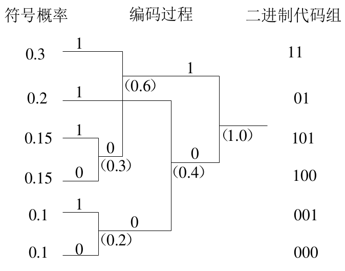

<!-- ---
title: 第四章 - 离散信源的信源编码
date: 2022-05-14T21:12:00+08:00
categories: ["信息论"]
layout: note
article: false
--- -->

# 第四章 离散信源的信源编码

## 4-1 信源编码的模型

**信源编码**
- 含义：将信源产生的消息变换为数字序列的过程
- 主要任务：把消息信号数字化为由信道基本符号构成的代码组（码字），并压缩冗余度，提高编码效率

编码是否会损失信源消息的信息量：
- 不损失信息量：无失真信源编码 -> 香农第一定理
- 会损失信息量：限失真信源编码 -> 香农第三定理

1. 选择合适的信道基本符号（**码元**），使映射后的代码适应信道
2. 用编码将信源发出的消息转换为代码组，即**码字**，其长度称为**码长**
3. 编码应使消息集合与代码组集合中的元素一一对应

称上述一一映射的信源编码器为**正规编码器**，编出来的码为**非奇异码**

可以把信源和正规编码器合称**等效信源**，编码器的输入为**初始信源**

正规编码器的一一对应确保了编码不损失信息量，因此**等效信源的熵必定等于初始信源的熵**

研究信源编码时将信道编译码看作信道的一部分

- 若码字长度相等，称为**等长码**，反之为**变长码**
- 若信源符号与编码码字一一对应，称为**非奇异码**，反之为**奇异码**
- 若每个码元所占时间相同，称为**同价码**，反之为**非同价码**（例如莫尔斯电码）
- **N 重扩展码**：针对 N 重扩展信源编码得到的码字序列集合
- 若任意一串码字序列只能唯一的译为对应的信源符号序列，称为**单义可译码**，反之称为**非单义可译码**
  - 不但要求信源符号与编码码字一一对应，即为非奇异码，还要求任意长的信源符号序列对应的码字序列一一对应，即**任意 N 重扩展码均为非奇异码**
  - 非单义可译码会发生译码错误，导致失真

## 4-2 信息传输速率和编码效率

### 4-2-1 信息传输率

**定义4.1** 对于信源编码器的输出序列，其每个码元所包含的信息量称为 **信源编码器的信息传输率**，简称 **码率 R**
- R 的单位为 bit/码元
- 若每个码元时间为 t 秒，则可以定义信息传输速率 $R_t=R/t bit/s$

**等长码**：
- 单符号离散信源：设信源熵为 $H(X)$，对其等长编码，每码字 b 个码元，则其信息传输率为 $R=H(X)/b bit/码元$
- K 重扩展信源：设信源熵为 $H(X^K)$，对其等长编码，每码字 B 个码元，则其信息传输率为 $R=H(X^K)/B bit/码元$

**变长码**：
- 先求其代码组的平均长度
- 单符号离散信源：设信源有 N 个单符号消息 $x_1,x_2,\dots,x_N$，变长码编码器输出的代码组长度对应为 $b_1, b_2, \dots, b_N$，其出现概率分别为 $P(b_1),P(b_2),\dots,P(b_N)$，则该变长码的平均长度为 $\bar{b}=\sum^N_{i=1}P(b_i)b_i$，信息传输率为 $R=H(X)/\bar{b}$ bit/码元
- K 重扩展信源：设信源有 N 个 K 重扩展的符号序列消息 $x_1,x_2,\dots,x_N$，变长码编码器输出的代码组长度对应为 $B_1, B_2, \dots, B_N$，其出现概率分别为 $P(B_1),P(B_2),\dots,P(B_N)$，则该变长码的平均长度为 $\bar{B}=\sum^N_{i=1}P(B_i)B_i$，信息传输率为 $R=H(X^K)/\bar{B}$ bit/码元

### 4-2-2 编码效率

**信道容量**：信道的极限传输能力（平均互信息量的最大值）。根据平均互信息量的定义，在不失真传输的条件下，信道容量等于信源熵的最大值，$C=\max I(X;Y)=H(X)-H(X|Y)=H(X)$

对于含有 D 个元素的信道基本符号集合，等效信源的最大熵等于 $\operatorname{lb} D$ bit/码元，因此 $C=\operatorname{lb} D$ bit/码元

**定义 4.3** 信源编码器输出代码组的信息传输率与信道容量之比，称为信源编码器的编码效率，即 $\eta=\frac{R}{C}\times 100\%$

- R = C 时，信源编码能充分利用信道
- R > C 时，信源编码输出信息的速率超过了信道传输能力，必然失真
- R < C 时，未充分利用信道

**编码效率**：
$$\eta=\frac{H(X^K)/\bar{B}}{\operatorname{lb}D}\times 100\%$$

要提高编码效率可以减小代码组的平均长度

通常称具有最短的代码组平均长度或编码效率接近于 1 的信源编码为最佳信源编码，亦简称为**最佳编码**

要达到最佳编码，通常需遵循下面两个原则：
1. 对信源中出现概率大的消息（或符号），尽可能用短的代码组（码字）来表示，简称短码；反之用长码
2. 不使用间隔即可区分码字
   - 要求**单义可译性**

原则一可以描述为：

**定理4.1** 设信源有 N 个消息分别为 $x_1, x_2, \dots, x_N$，出现概率分别为 $P(x_1), P(x_2), \dots, P(x_N)$，信源编码器输出的 N 个代码组分别为 $s_1, s_2, \dots, s_N$，对应长度分别为 $b_1, b_2, \dots, b_N$，若信源消息的概率分布满足 $P(x_1) >P(x_2)>\dots> P(x_N)$，而信源编码器输出的代码组长度满足 $b_1<b_2<\dots<b_N$，则该代码组的平均长度为最短。

最佳编码应满足 $b_i\geq\log_D\frac{1}{P(x_i)}$，即可满足单义可译

## 4-3 单义可译定理

**定义 4.4** 对任何一个有限长度的信源消息序列，如果编码得到的码字序列不与其他任何信源消息序列所对应的码字序列相同，则称这样的码为单义可译码。

即时码：译码时不需要考察后续码元，一定为单义可译码

**定理 4.2** 设 $s_i (a_{i1} a_{i2}\dots a_{ik})$ 是码 S 中的任一码字，码 S 为即时码的充要条件是：对于任意的 m＜k ，任意码字 $s_j (a_{j1} a_{j2}\dots a_{jm})$ 都不是码字 $s_i (a_{i1} a_{i2}\dots a_{ik})$ 的前缀。

等长码都是即时码

即时码 ⊆ 单义可译码 ⊆ 非奇异码 ⊆ 所有码

**定理 4.3 单义可译定理 即时码存在定理** 设信源消息集合为 $X=\{x_1, x_2, \dots, x_N\}$，信道基本符号的种类为 D，码字集合为 $S={s_1, s_2, \dots, s_N}$，对应的码长集合为 $b={b_1, b_2, \dots, b_N}$，则存在即时码的充分必要条件是：D、N 和码长应满足如下不等式：
$$\sum^N_{i=1}D^{-b_i}\leq 1$$
上式称为 Kraft 不等式。

任何一个结构为 $N, D, b_i (i =1, 2, \dots, N)$ 的即时码一定满足 Kraft 不等式；而满足 Kraft 不等式的 $N, D, b_i$ 又至少可构成一种结构为 $N, D, b_i$ 的即时码

**定理 4.4 平均码长界定定理** 若一个离散无记忆信源 X，具有熵 $H(X)$，对其编码用 D 种基本符号，则总可以找到一种无失真信源编码，构成单义可译码，使其平均码长满足
$$\frac{H(X)}{\operatorname{lb}D}\leq\bar{b}\leq\frac{H(X)}{\operatorname{lb}D}+1$$

**平均码长界定定理的物理意义**：
- 下界证明是充要性证明，因此单义可译前提下平均码长的下界值为 $\bar{b}_{min}=\frac{H(X)}{\operatorname{lb}D}$
- 也可以从信息传输率的角度理解下界，即 $\frac{H(X)}{\bar{b}}\leq{\operatorname{lb}D}$，信息传输率不能超过信道容量，否则无法实现单义可译，从而造成译码错误
- 由于上界证明仅仅是充分性证明，因此平均码长大于定理中的上界也可能是单义可译码
- 给定信源空间 $\{X，P(X)\}$ 的离散信源，其熵 $H(X)$ 是确定值，如果信道基本符号数 D 也给定，则 $\bar{b}_{min}$也就定了。为此，需要改变信源本身统计特性，例如进行扩展
  - 扩展后，可能使得每个消息的长度 $B_i/K<b_i$，这样平均长度也应减小

## 4-4 无失真信源编码定理

**二进制编码和无记忆信源条件下香农第一定理**：
- 对于二进制编码，D=2。根据平均码长界定定理有 $H(X)\leq\bar{b}\leq H(X)+1$
- 类似地，对初始信源进行 K 重扩展，有 $H(X^K)\leq\bar{B}\leq H(X^K)+1$
- 对于无记忆信源，$H(X^K)=KH(X)$ 成立，因此 $H(X)\leq\frac{\bar{B}}{K}\leq H(X)+\frac{1}{K}$
- 当 $K\rightarrow\infty$，有 $\lim_{K\rightarrow\infty}\frac{\bar{B}}{K}=H(X)$
- 上式即是二进制编码和无记忆信源条件下香农第一定理的数学表示式

**定理 4.5 香农第一定理 无失真信源编码定理 变长码信源编码定理**：
设离散无记忆信源 X 包含 N 个符号 $\{x_1, x_2, \dots, x_N\}$，信源发出 K 重符号序列，
则此信源可发出 $N^K$ 个不同的符号序列消息，其中第 j 个符号序列消息的出现概率为 $P_{Kj}$，
其信源编码后所得的 D 进制代码组长度为 $B_j$，代码组的平均长度为 $\bar{B}=\sum^{N^K}_{j=1}P_{Kj}B_j$，
总可以找到一种编码构成单义可译码，使得 $\bar{B}$ 满足
$$\frac{H(X)}{\operatorname{lb}D}\leq\frac{\bar{B}}{K}\leq\frac{H(X)}{\operatorname{lb}D}+\frac{1}{K}$$
当K趋于无限大时，$\lim_{K\rightarrow\infty}\frac{\bar{B}}{K}=\frac{H(X)}{\operatorname{lb}D}$

定理指出
- 要做到无失真的信源编码，每个信源符号平均所需要最少的 D 进制码元数，就是信源的熵值（熵定义中的log底数为D），或记为 $H_D(X)\triangleq\frac{H(X)}{\operatorname{lb}D}$
- 扩展信源可以减少平均码元数，但有极限
- 此外，减少平均码元数是以增加编码的复杂性（存储复杂度）为代价的
- 从编码效率角度理解，不等式取到下界时，编码效率为 100%，可见无失真信源编码的实质就是对离散信源进行适当的变换，使变换后新的符号序列信源尽可能为等概率分布，以使新信源的每个码符号平均所含的信息量达到最大，进而使信息传输率R达到信道容量C，实现信源和信道理想的统计匹配

### 4-5-1 香农编码方法

1. 先将信源消息的概率按 $P(x_1) \geq P(x_2) \geq \dots \geq P(x_N)$降序排列，然后计算 $P_i=\sum_{k=1}^{i-1}P(x_i)$，即 $P_i$ 为前 i–1 个概率的累加
2. 再把 $Pi$ 变为二进制小数，取小数点后的 $b_i$ 位数作为第 i 消息的码字，其中 $b_i$ 满足
$$b_i=\lceil\log_D\frac{1}{P(x_i)}\rceil$$

> 二进制小数：将小数部分一直乘 2，积的整数部分顺序取出

**特点**：
- 先得到码长，再得到码字
- 码字集合唯一
- 并非一定最优

### 4-5-2 费诺编码方法

又称子集分解法

1. 将信源消息符号按其出现的概率大小依次排列
2. 将依次排列的信源符号按概率值分为两大组，使两个组的概率之和接近相同，并对各组赋予一个二进制码元“0”和“1”
3. 将每一大组的信源符号进一步再分成两个组，使分解后的两个组的概率之和接近于相同，并又赋予两个组一个二进制符号“0”和“1”
4. 如此重复，直至每个组只剩下一个信源符号为止

**特点**：
- 先得到码字，再得到码长
- 码字集合唯一

### 4-5-3 霍夫曼编码

本科数字通信笔记第四页，这里使用 as low as possible 或者 as high as possible 都可以

**特点**：
- 码字集合不唯一

### 4-5-4 Lempel-Ziv 编码

<!-- 
|          |(初始)1|(初始)2|     3|     4|     5|     6|     7|
|----------|------:|------:|-----:|-----:|-----:|-----:|-----:|
|子列      |      0|      1|  0\|0|  0\|1| 01\|1|  1\|0| 01\|0|
|地址      |       |       |  1\|1|  1\|2|  4\|2|  2\|1|  4\|2|
|二进制地址|       |       |001\|0|001\|1|100\|1|010\|0|100\|0|

二进制地址出，后半部直接取子列值，而非地址
 -->

与本科数字通信所学不一样

|    |   1|   2|   3|   4|   5|
|----|---:|---:|---:|---:|---:|
|子列|a   |b   |aa  |aab |aaba|
|编码|0a  |0b  |1a  |3b  |4a  |

未出现过的子列用 0 开头

**特点**：
- 独立于信源的统计特性，是一种变长到定长的编码方案
- 利用了已编码信息来进行当前的编码，是等长码，编码的过程就是建立码地址和将待编码消息序列分段的过程，所有的码段内容都是不同的
- 对于长的消息序列，压缩比较明显
- 地址会不断变长，可以用相对地址解决
  - 将编码结果表示为3部分内容：<相对地址，可利用的已编码信息长度，本次编码新增加字符>，称之为编码包
  - 第一部分：利用的已编码信息在当前信息之前多少 **位**，是按序列数的，不是按包
  - 第二部分：利用的已编码信息长度
  - 两个相当于是 数组首地址（相对） 和 数组长度

### 4-5-5 等长码的信源编码定理

设等长码的信源的消息符号集合为$X=(x_1, x_2, \dots, x_N)$，进行 K 重扩展后，符号序列消息的总数为 $N^K$；设信道有 D 种基本符号，每个码字有 B 个码元，故最多有 $D^B$ 种码字，要满足单义可译性，应满足 $D^B\geq N^K$ ，即
$$B\geq K\frac{\operatorname{lb}N}{\operatorname{lb}D}$$
或
$$\frac{B}{K}\operatorname{lb}D\geq\operatorname{lb}N=H(X)_{max}$$

但实际可以只对典型序列编码，即 $D^B\geq$ 典型序列个数

**定理 4.6** 设 K 重扩展的符号序列消息集合中，对于任意小的 $\delta$，当 $\frac{B}{K}\operatorname{lb}D\geq H(X)+\delta$ 时，只要 K 足够大，译码错误概率 $P_e$ 就可以任意小。若 $\frac{B}{K}\operatorname{lb}D< H(X)-2\delta$，则当 $K\rightarrow\infty$ 时，$P_e$ 可以任意地接近于 1

**等长码的信源编码定理的物理意义**：
$B\operatorname{lb}D / K >H (X)$ 或 $KH (X) / B <\operatorname{lb}D$ 时，更有效的信源编码存在

对于等长码，K需要非常大（上千）才能获得低译码错误概率和高编码效率

传输所造成的错误会产生所谓“扩展效应”，简称为译码的错误扩展。例如，传输过程1-bit的错误可能导致信宿端多个消息的译码错误。这需要信道编码来保证传输正确
