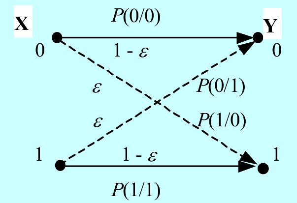
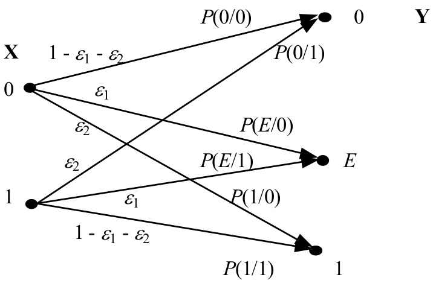

<!-- ---
title: 第五章 - 离散信源及其信道编码
date: 2022-05-15T22:26:00+08:00
categories: ["信息论"]
layout: note
article: false
--- -->

# 第五章 离散信源及其信道编码

## 5-1 信道的分类及其描述

（1） 信道按输入/输出符号空间的性质来划分，根据幅度和时间上的取值是离散或连续，分为四类：
- 离散信道：输入和输出的随机序列取值均为离散的信道，也称为数字信道
- 连续信道：输入和输出的随机序列取值均为连续的信道
- 半离散或半连续信道：输入序列是离散型但相应输出序列是连续的信道，或者相反
- 波形信道：输入和输出都是时间上连续的随机信号，也称为模拟信道

（2）按信道的输入消息集合和输出消息集合的个数来划分：
- 两端信道：信道的输入消息集合只有一个X集合，同时信道的输出消息集合也只有一个Y集合，又称为单向单路信道
- 多端信道：信道的输入端和输出端中，至少有一端具有一个以上的消息集合，又称为多用户信道

（3） 信道按输入/输出信号间的关系是否确定来划分，
- 无扰信道：信道输入/输出之间是一种确定的关系，这是一种理想化的信道，信道上不存在噪声及干扰。可以作为衡量其他信道特性的参考
- 有扰信道：信道输入/输出之间是一种统计依存的关系，信道上存在干扰和（或）噪声。实际的通信信道几乎都是有扰信道

（4） 信道按其输入/输出之间关系的记忆性来划分，
- 无记忆信道：在某一时刻信道的输出消息仅与当时的信道输入消息有关，而与前面时刻的信道输入或输出消息无关。信道的统计特性可以用信道传输概率的集合{P(y|x)}来描述
- 有记忆信道：在任意时刻信道的输出消息不仅与当时的信道输入消息有关，还与以前时刻的信道输入和（或）输出消息有关。实际信道一般都是有记忆的

（5）信道按其统计特性来划分，
- 恒参信道：信道的统计特性不随时间变化，又称为平稳信道
- 变参信道：信道的统计特性随时间变化

## 5-2 无扰离散信道的传输特性

**定义 5.1** 单位时间内所传输的信息量，称为消息在信道中的**信息传输速率**，简称为信息率 R
- 量纲为比特/码元或比特/符号、比特/符号序列等时，用 R 表示
- 量纲为 bit/s 或 bps，用 $R_t$ 表示

平均互信息量 $I(X;Y)$ 代表收到 Y 后获得关于 X 的平均信息量，因此实质上就是量纲为比特/码元（或比特/符号、比特/符号序列等）的信息传输速率，即 $R =I(X;Y)$ bit/码元；如果改变其时间单位，则有 $R_t =\frac{1}{t} I(X;Y)$ bit/s
- 无扰离散信道下信息传输速率等于信源熵，即$R =H(X)$ bit/码元；$R_t =\frac{1}{t} H(X)$ bit/s

**信道容量**：
消息在不失真传输的条件下，信道所允许的最大信息传输速率称为信道容量，即 $C = R_{max}$ bit/码元；当单位为bit/s（bps）时，C 变换为 $C_t =R_{t max}$ bit/s

**信道容量和信道中传输的消息数目 N 的关系**：
对无扰信道，信道传输的信息量就是信源发出的信息量，根据最大信息熵定理，所有信源符合等概率的时候信源熵最大，因此信道容量 $C=\operatorname{lb}N$ bit / 码元；$C=\frac{\operatorname{lb}N}{t}$ bit / s

**定义5.3** 基本符号时间等长的信道称为**均匀编码信道**，这种等长的基本符号称为**码元**。

- 损失熵：$H(X|Y)$
- 噪声熵：$H(Y|X)$

**无噪无损信道**：输入与输出符号一对一
- 损失熵 $H(X|Y)$ 和 噪声熵 $H(Y|X)$ 均为 0，$I(X;Y)=H(X)=H(Y)$
- 信道容量 $C=\max_{P(x)}I(X;Y)=\max_{P(x)}H(X)=\operatorname{lb}|X|$ bit/码元

**无噪有损信道**：输入与输出符号多对一
- 损失熵 $H(X|Y)\neq0$，噪声熵 $H(Y|X)=0$，$I(X;Y)=H(Y)<H(X)$
- 信道容量 $C=\max_{P(x)}I(X;Y)=\max_{P(x)}H(Y)=\operatorname{lb}|Y|$ bit/码元

**有噪无损信道**：输入与输出符号一对多
- 损失熵 $H(X|Y)=0$，噪声熵 $H(Y|X)\neq0$，$I(X;Y)=H(X)<H(Y)$
- 信道容量 $C=\max_{P(x)}I(X;Y)=\max_{P(x)}H(X)=\operatorname{lb}|X|$ bit/码元

## 5-3 有扰离散信道的传输特性

**信道矩阵**：（给出信道特性）
$$
\Pi=\left[\begin{array}{cccc}
P\left(y_{1} \mid x_{1}\right) & P\left(y_{2} \mid x_{1}\right) & \cdots & P\left(y_{L} \mid x_{1}\right) \\
P\left(y_{1} \mid x_{2}\right) & P\left(y_{2} \mid x_{2}\right) & \cdots & P\left(y_{L} \mid x_{2}\right) \\
& \ddots & & \\
P\left(y_{1} \mid x_{M}\right) & P\left(y_{2} \mid x_{M}\right) & \cdots & P\left(y_{L} \mid x_{M}\right)
\end{array}\right]_{M \times L}
$$

$P(y_j|x_i)$ 为信道传输概率

**对称离散信道**：
信道矩阵的所有行由相同元素组成，所有列也由相同元素组成

**强对称离散信道（均匀信道）**：信道矩阵为方阵
$$
\mathbf{P}=\left[\begin{array}{ccccc}
\bar{p} & \frac{p}{r-1} & \frac{p}{r-1} & \cdots & \frac{p}{r-1} \\
\frac{p}{r-1} & \bar{p} & \frac{p}{r-1} & \cdots & \frac{p}{r-1} \\
\vdots & \vdots & \vdots & \cdots & \vdots \\
\frac{p}{r-1} & \frac{p}{r-1} & \frac{p}{r-1} & \cdots & \bar{p}
\end{array}\right], \quad p, \bar{p} \in[0,1], \quad p+\bar{p}=1
$$
- 总错误概率为p，均匀分给r-1个输出符号
- 信道矩阵各列之和也等于1

**二进制对称信道（BSC）**：其中$\varepsilon$为交叉传输概率

$$
\Pi=\left[\begin{array}{cc}
1-\varepsilon & \varepsilon \\
\varepsilon & 1-\varepsilon
\end{array}\right]
$$

**准对称离散信道**
- 信道矩阵的列可以分解为若干互不相交的子集，每个子集构成的矩阵都对应对称信道

**二进制删除信道**：

$$
\Pi=\left[\begin{array}{ccc}
1-\varepsilon_{1}-\varepsilon_{2} & \varepsilon_{1} & \varepsilon_{2} \\
\varepsilon_{2} & \varepsilon_{1} & 1-\varepsilon_{1}-\varepsilon_{2}
\end{array}\right]
$$
