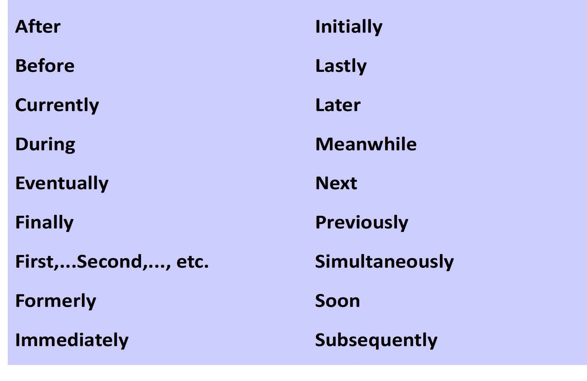
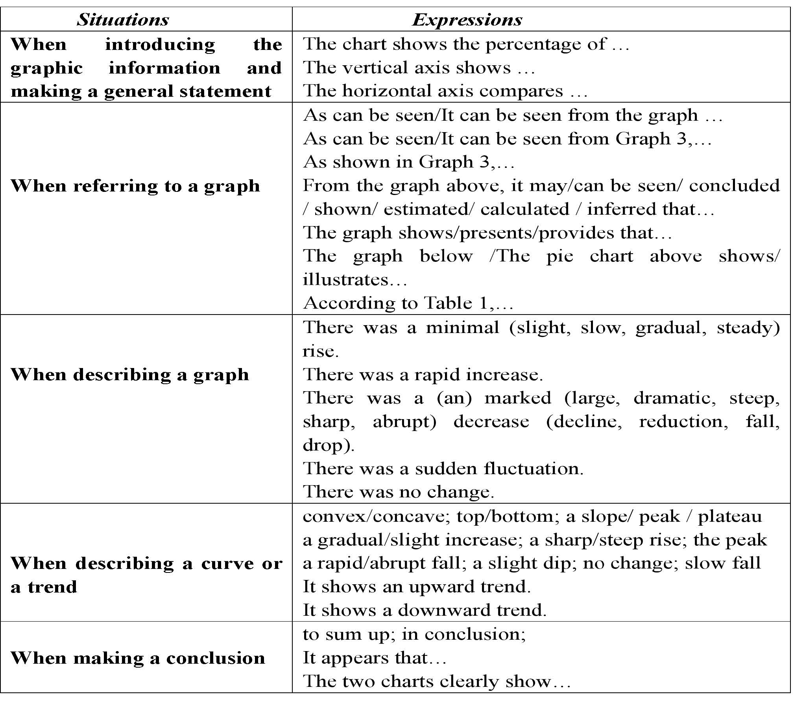
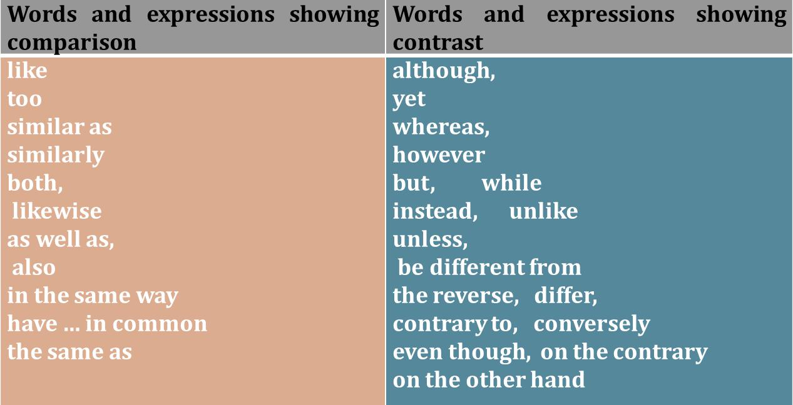

<!-- ---
title:      英文技术写作
date:       2022-03-16T13:00:00+08:00
article: false
--- -->

- rationales：基本原理
- discourse：语篇
- anticlimax: 虎头蛇尾
- prevail: 流行
- hedging: 模糊的
- bjectivity: 客观的

# 1 Overview

## 1-1 Register

register 语域：写作、演讲风格，代表了语言正式的程度

5 Registers
- Static (frozen) 套话
- Formal (regulated)
- Consultative (professional/ academic) 商议的
- Casual (group)
- Personal (intimate)

## 1-2 Title

S.C.I:
1. specific
2. concise
3. informative

HOW:
1. Choose a topic: interesting
2. Narrow down: specific
3. Paraphrase: noun phrase

## 1-3 Nominalization 名词化

Why
1. increase information density and facilitate efficiency and accuracy of communication.
2. express abstract concepts (e.g., revolution, possibility) 描述抽象概念
3. hide the agent behind an action
4. improve flow of writing , maintain connections between ideas
5. make writing more “written” and professional

How:
1. a simple sentence
2. nominalized subject
3. second verb
4. finisher idea

## 1-4 Personal Pronouns

> 并非完全不能用第一人称

Avoid first and second person pronouns to be impersonal and scientific

Use gender-fair language
- Use "he or she" or "a person" instead of "he"

## 1-5 Word Choice and Sentence Variety

### 1-5-1 Word choice

#### Abstract and concrete words

- Abstract: loyal, love
- Concrete: battle, horse

#### Generral and specific words

- general: tree
- specific: southern red oak

#### Denotation and connotation

指示词（客观）和内涵词（带感情色彩的词）

| denotation | connotation |
|---|---|
| primary or literal meaning | secondary or implied meanings |
| exact or surface | baggage or associations |
| tip of iceberg | impart the most meaning |
| e.g. "house" | e.g. "home" |

#### Figurative speech

生动性

employs figures of speech

1. simile，明喻
2. metaphor，隐喻
3. personification，拟人

#### Choose appropriate vocabulary

1. Avoid using unfamiliar synonyms 避免使用生僻的同义词，不要装逼
2. Avoid slang 避免俚语
3. Avoid wordiness 避免冗长

### 1-5-2 Sentence variety

四种基础句式：
1. 简单句
2. 并列句
3. 复合句
4. 并列复合句

# 2 Literature Review

1. Information prominent citation：作者待在括号里
2. Author prominent citation：作者是主语
3. Weak author prominent citation：authors 是主语，一群作者待在括号里

## 2-1 Reviewing Literature

A literature review is a careful examination of a body of literature
pointing toward the answer to your research question.

Include a critical analysis of various opinions from credible sources

## 2-2 Writing Literature Review

简单文献综述模型：
- 研究兴趣
- 研究话题
- 文献综述
- 研究论文

复杂文献综述模型：在简单模型的基础上增加
- **研究问题**
- **研究项目**

顺序：
- Chronological（时间） － Trace the development of the topic over time
- Thematic（主题） － Address different aspects of the topic in subsections
- Methodological（方法） － Compare the results & conclusions from different approaches
- Theoretical（理论） － Discuss various theories, models, and definitions of key concepts.

技巧：
1. introduction to topic
2. support from the literature
3. mini summary
4. introduction to next topic.

## 2-3 Avoiding Plagiarism（剽窃）

方法：
1. Quoting（引用）
2. Paraphrasing（转写）
3. Summarizing（概括）

## 2-4 Reporting Verbs

Function and strength| Example verbs
|---|---|
NEUTRAL: verbs used to say what the writer describes in factual terms, demonstrates, refers to, and discusses, and verbs used to explain his/her methodology. | describe, show, reveal, study, demonstrate, note, point out, indicate, report, observe, assume, take into consideration, examine, go on to say that, state, believe (unless this is a strong belief), mention, etc.
TENTATIVE: verbs used to say what the writer suggests or speculates on (without being absolutely certain). |suggest, speculate, intimate, hypothesize, moot, imply, propose, recommend, posit the view that, question the view that, postulate, etc.
STRONG: verbs used to say what the writer makes strong arguments and claims for. | argue, claim, emphasize, contend, maintain, assert, theorize, support the view that, deny, negate, refute, reject, challenge, strongly believe that, counter the view/argument that, etc.

## 2-5 Tenses in Literature review

常用一般现在时、现在完成时

一般现在时：陈述事实或者真理的东西

只有在以下情况可以用一般过去时：
1. 主句出现年份、时间（不是括号）
2. 提到废弃研究

# 3 Methods and Results

> “限制条件”预防了数据失效

## 3-1 The Structure of the Method Section

==Different **titles** of the method section==
- Materials and Methods
- Theory and Methods
- Theoretical Framework and Methods

The major elements in the method section
- The method section
  - Methodology
  - The rationales
  - The fundamental reasons or principles of doing things
- Steps
- Materials

避免抄袭：
- 感谢作者
- 熟悉实验设计和实施
- 好好引用

## 3-2 The Structure of the Results Section

Major elements
- The statement showing where the results can be found
- The statement presenting the most important findings
- The statement commenting on the results

The order of the results
- Research questions
- Research methods

The language focuses
- Sequential markers
- Graphic descriptions
- Comparison and contrast

## 3-3 Sequential Markers

Importance of sequential markers
- Building up connections between ideas
- Ensuring that sentences and paragraphs flow together smoothly

## 3-4 Graphic Description

Description of Graphs
1. Introduce the graphic information briefly and indicate the main trend. Normally it includes the place, time, content and purpose of the graph;
2. Describe the relevant and most important or signi ficant data and make some comparison if necessary;
3. Summarize the data/trends

Expressions for highlighting significant data in a table/chart
- some adjectives such as “apparent”, “clear”, “interesting”, “obvious”, “revealing” and “significant”

## 3-5 Comparison and Contrast

- 比较：相同点
- 对比：不同点

Two major ways of organization:
1. Block comparison or block contrast（分块对比）
   1. To examine one thing thoroughly and then examine the other
2. **Alternating** comparison or alternating contrast（交替对比）
   1. To examine two things at the same time, discussing them point by point

Tips for making comparison or contrast
- Not all the information has to be compared or contrasted with each other.
- It is not necessary to lay equal emphasis on every change.
- The comparison/contrast should be supported by concrete and relevant facts or data.

# 4 Discussion & Conclusion

## 4-1 Structure of Discussion Section

7 elements the Discussion section typically contains:
1. An overview ...
2. A consideration ...
3. Implications ...
4. A careful examination ...
5. Limitations ...
6. Recommendations ...
7. Implications ...

### 4-1-2 Strategies and steps to structure the Discussion

#### How to begin the Discussion

1. Remind readers
2. Refer back to the questions
3. ==Refer back to papers==
4. Briefly restate ... from your Results

#### How to compare my work with those of others

## 4-2 Structure of Conclusion Section

Key elements of Conclusions section:
1. a very brief revisit of the most important findings ...
2. a final judgment on the importance and significance of those findings ...
3. an indication of the limitations ...
4. suggestions for ...
5. recommendations for ...

Typical issues in structuring the Conclusion
1. Redundancy: repetition of
2. Raising a Totally New Point: introducing less ...
3. Overstatement （夸大）: making immoderate...
4. Anticlimax（虎头蛇尾）：failure to ...

Discussion sections which also have a Conclusion may end:
- Tell your readers ... But you must ... If you repeated
- Suggest ways that
- Say if and / or why you ignored
- Admit ...
- Reiterate your reasons for ...

## 4-3 Language Focus 1: Cause and Effect

- Identifying causes and effects
- Drafting thesis statements for causes or effects
- Tips on planning causes and effects
  1. Distinguish direct and indirect causes and effects.
  2. Group different causes and effects
  3. Avoid mistaking coincidence (two unrelated things happening together) for cause or effect
  4. Avoid oversimplification
     1. 因为许多问题非常复杂

## 4-4 Language Focus 2: Paraphrasing

Why
- Plagiarism detection system
- A case of unintentional plagiarism

How
- Lexical（词汇）
  - 同义词
  - 改词性
- Syntactic（句法）
  - 双重否定
  - 主语换位
  - 主被转换
  - 语序转换
- Combined

## 4-5 Language Focus 3: Strong Restatement of the Research Objective

- Two features of a strong thesis statement
  - It makes a claim that requires ...
  - It makes a claim that offers ...
- Five kinds of weak thesis statements
  - Statements that make no claim
  - Statements that are obviously true or a statement of fact
  - Statements that restate conventional wisdom
  - Statements that offer personal conviction as the basis for the claim
  - Statements that make an overly broad claim

# 5 Publication

## 5-1 Abstract 

Essential elements：
- the background
- the problem
- the methods
- the results
- the implications

Action | Tense
---|---
Giving background details | 一般现在时
Describing the research activity | 一般过去时 或 现在完成时
Describing the methods | 一般过去时（主动或被动）
Reporting results | 一般过去时
Stating conclusions | 一般现在时

- 背景/目标：一般现在时
- 过程/方法：一般过去时
- 结果

The Types of abstracts
1. Informative abstract
2. Structured abstract
   1. 分段，每段开头为粗体的 Aim, Methods, Results, Research limitations/implications 或 Conclusion

## 5-2 Keywords

Definition of keywords:
- standout within the Abstract
- important words in the abstract
- emphasize the key information for readers

Purpose of keywords:
- increase the probability that a paper will be read and retrieved
- potentially improve citation counts and journal impacts
- know what words reflect the key information of the paper
- read more carefully when meeting these words in the paper

Categories:
- Discipline
- Topic
- Location
- Methods
- Data source

Number of keywords
- can’t be too few or many
- 3~5 in journals
- trade-off between the keywords to meet the limitation requirements for keywords
- choose the keywords from recent or often-cited titles close to their contribution

## 5-3 Reference

- IEEE: `[编号]. 作者名缩写. 作者姓, “文章题目,” 斜体期刊名称, 城市, 洲, 国家, 月日, 年, 页码`
- MLA: `作者姓, 作者名. “文章题目.” 斜体期刊名称, vol. 期刊号, no. 发行号, 发行年份, pp. 页码`

Functions
- used to avoid plagiarism
- tell editors and readers what sources have been cited in the paper
- help readers to use the materials to refer to when they write papers

Standard of a good reference:
1. Authoritative
2. Up-to-date
3. Journal-targeted

## 5-4 Acknowledgement

Two main types of acknowledgements
- One is in a paper, and expresses the thanks to the organizations or projects or funds.
- The other is in a dissertation（大论文） as mentioned in the first part.

## 5 Submitting: writing the journal submission cover letter

Why a convincing cover letter?
- Highlighting the merit and significance
- Interesting the editor

What is included in the cover letter ?
- Follow the author guide.
- include essential information
- claim the originality of the paper

What should be avoided in the cover letter?
- Don't use too much jargon and acronyms.
- Don’t exaggerate.
- Don't make it lengthy.
- Don't try to be entertaining.
