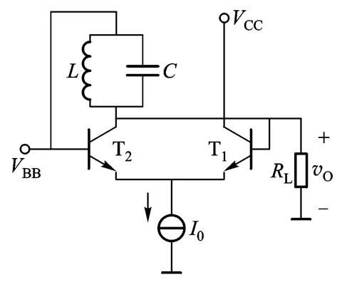
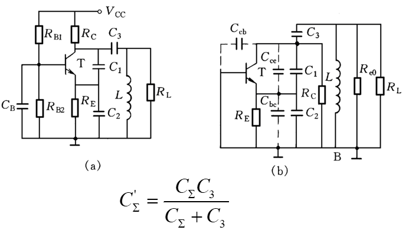
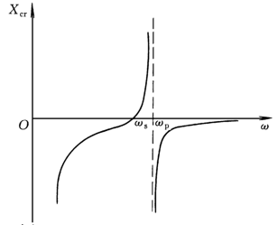
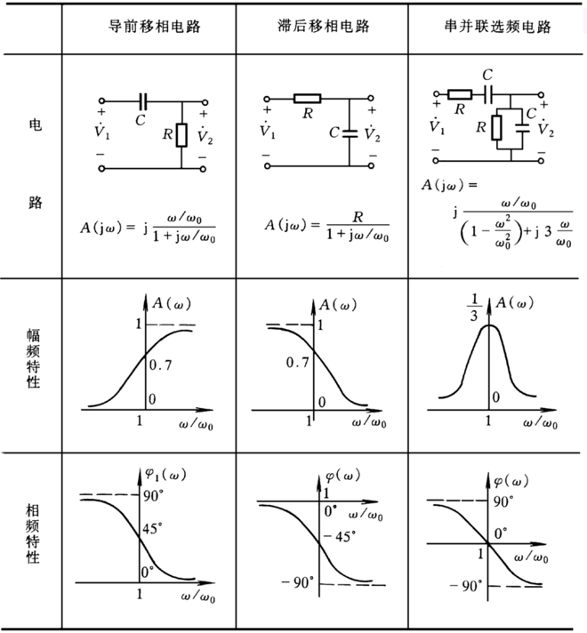
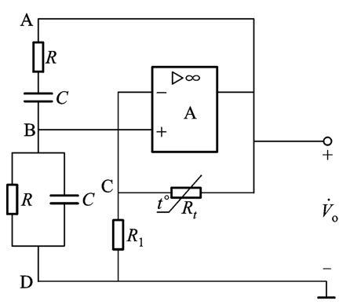
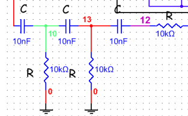
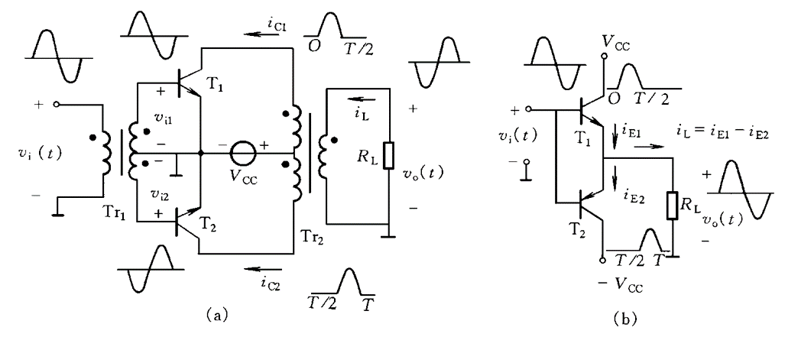
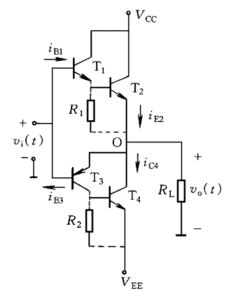

<!-----
title: 模电下
date: 2020-01-26T21:12:31+08:00
categories: 模电
# tags:		["学习"]
----->

# 模电 下

## 7 振荡器

变压器的交流通路仍是变压器

起振时可认为是小信号状态

**振幅起振条件**：开环增益$T(\omega_{osc})=\frac{V_f}{V_i}>1$

二反相放大器增益>3

**相位起振条件**：$\varphi_T(\omega_{osc})=2n\pi$

**稳定条件**：$T(\omega_{osc})=1$，$\varphi_T(\omega_{osc})=2n\pi$

### 7-2 LC正弦波振荡器

#### 7-2-1 变压器耦合振荡电路

变压器特性：同名端极性相同

#### 7-2-2 三点式振荡电路

三极管的三个电极分别与并联谐振回路的三个引出端点相连

1.  电容三点式振荡电路：两串联电容与电感并联
2.  电感三点式振荡电路：两串联电感与电容并联

**BE和CE间为同性质电抗，BC为异性质，电路以发射极所接电抗类型命名**

有时可以利用晶体管的等效阻抗：等效阻抗$C_{b'e}$或$C_{gd}$，但其值极小，一般仅在原电路中无该类型电抗时才能使用

*   **LC串联电路：电路频率高于自谐振频率时呈感性**
*   **LC并联电路：电路频率低于自谐振频率时呈感性**

先画出电路的交流通路，再断开闭合环路

常将负载电阻以外的部分折算为谐振网络，以此利用谐振时谐振网络的特性来简化计算

相位起振条件常被简化为$X_1+X_2+X_3\approx0$，即三电抗之和为0

振幅起振条件被简化为$g_m>\frac{1}{n}g'_L=ng_i$，其中$n=\frac{X_2}{X_1+X_2}$

**自给偏置**

振幅增大时，发射结偏执电压将向截止方向移动，使放大器增益下降，提高了振荡的稳定性

**直流偏置**

注意直流时的电感的短路和电容的断路

#### 7-2-3 差分对管振荡电路

一管趋向截止而使差模传输特性进入平坦区

正反馈从一管的输出接至同一管的输入

### 7-3 LC振荡器的频率稳定性

$\varphi_T(\omega_{osc})=\varphi_z(\omega_{osc})+\varphi_f=0, \varphi_z(\omega)=-arcsin{Q_e}\frac{2(\omega-\omega_0)}{\omega_0}$

#### 7-3-3 克拉泼振荡电路

### 7-4 石英晶体振荡器

电压与形变形成正反馈

有串联、并联两个谐振点，串联谐振：短路；并联谐振：断路

$Z_{cr}(j\omega){\approx}jX_{er}=-j\frac{1}{\omega{C_0}}\frac{1-(\frac{\omega_s}{\omega})^2}{1-(\frac{\omega_p}{\omega})^2}$，$C_0$为石英静态电容、支架、引线组成的电容，$\omega_s=\frac{1}{\sqrt{L_qC_q}},\omega_p=\frac{1}{L_q\frac{C_qC_o}{C_q+C_o}}$，其两者之间的频率中的石英呈感性

#### 7-4-3 晶体振荡电路

**并联型**、**串联型**：由三点式振荡电路加上晶体得到

**并联型**：晶体呈断路用来替换电感（需注意直流通路）

**串联型**：晶体呈短路用来替换电容

### 7-5 RC正弦波振荡器

一级RC电路实际能提供的最大相移不到90°

外稳幅文氏电桥振荡电路。集成运放接同相放大器，提供零相移。

开路增益：$T(\omega_0)=\frac{1}{3}\frac{R_t+R_1}{R_1}$

RC串并联选频电路应与同相放大器相连

移相为0的电路的虚部为0

以上电路：$\omega_{osc}=\frac{1}{\sqrt{6}RC}$

## 8 功率电子线路

实质是能量转换器

### 8-1 功率电子线路概述

#### 8-1-1 功率放大器

**性能要求**

集电极效率$\eta_C=\frac{P_o}{P_D}=\frac{P_o}{P_o+P_C}$，其中$P_o$为输出功率，$P_D$为直流功率，$P_C$为管耗

*   甲类：全周导通，集电极效率最低
*   甲乙类：大于半周导通但不全通
*   乙类：半周导通
*   丙类：小于半周导通，集电极效率最高

#### 8-1-2 电源变换电路

*   整流器：AC-DC
*   斩波器：DC-DC
*   逆变器：DC-AC
*   交流-交流变换器：AC-AC

#### 8-1-3 功率器件

*   热阻：$R_{th}=\frac{T_2-T_1}{P}$
*   最大耗散功率：$P_{cm}=\frac{T_{jM}-T_a}{R_{th}}$
*   集电结与周围环境的热阻：$R_{th}=R_{(th)jc}+R_{(th)ca}$，jc：结与管壳，ca：管壳与环境
*   装散热器后总热阻：$R_{th}=R_{(th)jc}+R_{(th)cs}+R_{(th)sa}$
*   二次击穿：不限制电流的击穿会迅速由高压小电流转为低压大电流，且不可逆
*   功率MOS管
*   绝缘栅双极型功率管

### 8-2 功率放大器的电路组成和工作特性

#### 8-2-2 甲类、乙类功率放大器的电路组成及其功率性能 

##### 甲类变压器耦合功放

$R'_L=n^2R_L$

直流负载线：$v_{CE}=V_{CC}$

直流工作点Q：直流负载线与静态电流$i_B=I_{BQ},i_C=I_{CQ}$的三线交点

信号振幅只能取$V_{CC}$左侧以保证不失真，电流振幅只能取$I_{CQ}$上侧，以保证不失真

交流负载线：过Q的斜率为$-\frac{1}{R'_L}$

直流功率：$P_D=V_{CC}I_{CQ}$

集电极管耗：$P_C=P_D-P_o$

集电极效率：$\eta_c=\frac{P_o}{P_D}=\frac{1}{2}\frac{V_{cm}I_{cm}}{V_{CC}I_{CQ}},\eta_{c,max}=50\%$

要使输出信号功率最大，Q须在交流负载线中点：$V_{cm}=V_{cc},I_{cm}=I_{CQ}$

##### 乙类推挽功放

工作原理：
未输入信号时，两管截止，输出电压为0。
加信号$v_i = V_{im}sinωt$后，**两管轮流导通**。
正半周期，$T_1$导通，$T_2$截止，$i_{E1}=i_{C1}$；负半周期，$T_1$截止，$T_2$导通，$i_{E2}=i_{C2}$。通过负载$R_L$的电流$i_L=i_{E1}-i_{E2}$为完整的正弦波。

**此处为正负电源供电！若只有一个电源则所有VCC÷2，ξ×2（即$\frac{V_{cm}}{V_{CC}/2}$）**

电源电压利用系数：$\xi=\frac{V_{cm}}{V_{CC}}$

总直流功率：$P_D=P_{D1}+P_{D2}=\frac{2V_{CC}I_{cm}}{\pi}=\frac{4}{\pi}\xi{P_{Lmax}}$

集电极效率：$\eta_c=\frac{\pi}{4}\xi,\eta_{c,max}=\frac{\pi}{4}\%$

集电极管耗：$P_{C1}=(2\frac{\xi}{\pi}-\frac{\xi^2}{2})P_{Lmax}$

总功率：$P_C=(4\frac{\xi}{\pi}-\xi^2)P_{Lmax}$

#### 8-2-3  乙类互补推挽放大器实际电路

**交叉失真**

管子存在导通电压

须在BE间加正偏

**二极管偏置**

$V_{BB}=2V_Tln(I_R/I_S)$

**$V_{BE}$倍增偏置电路**

**准互补推挽电路**

复合管类型由第一个管的类型决定。例如图中T2类型与T1一致。

**保护电路**

$T_1,T_2$为保护管

**输入激励电路**

### 8-3 集成功率放大器

#### 8-3-2 功率运算放大器
